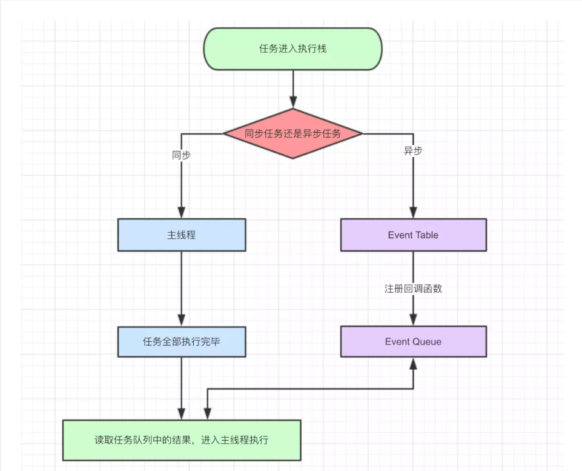
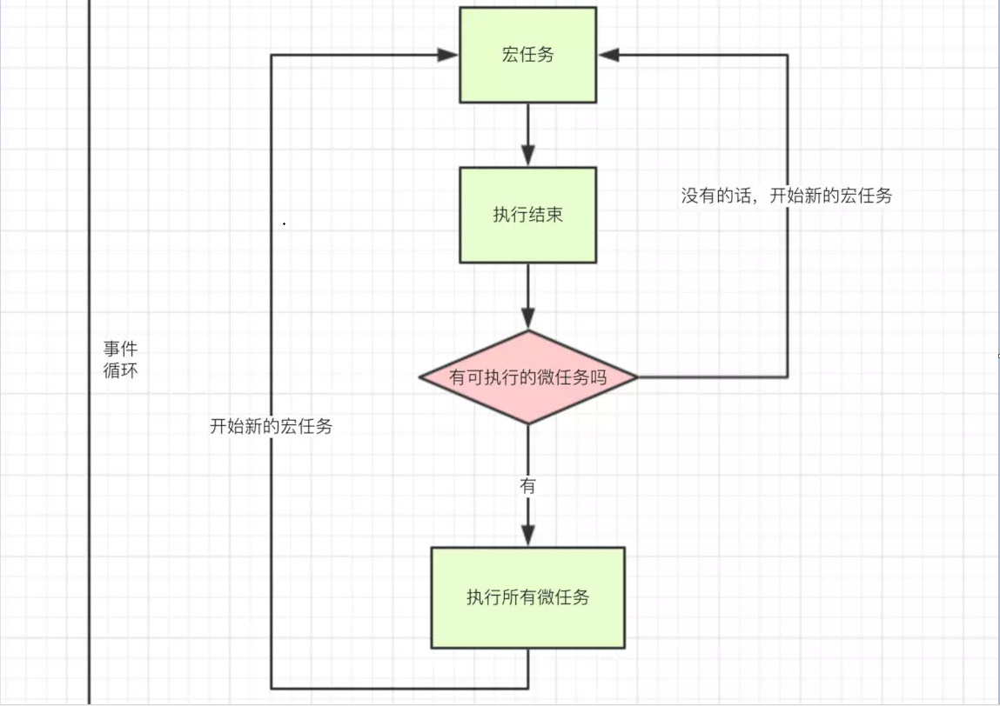

# javaScript 事件循环
js是单线程的
js事件循环其实就是js执行机制，为了实现js异步的一种方法。

## js事件循环处理过程
1. 将js代码分为同步任务与异步任务。如果是同步任务进入主线程进行执行，异步任务进入Event Table事件列表中，并注回调函数。
2. 当指定的事情完成时(如1.ajax请求完成时 2.setTimeout定时结束时)，Event Table将注册的回调函数移入到 Event Queue 事件队列中，等待执行。
3. 当主线程的任务完毕之后，会去Event Queue队列中读取相应的回调函数来，进入主线程执行。
4. 上述步骤会不断重复执行。

## 宏任务(macro task) 与 微任务(micro task)
异步任务分为 宏任务(macro task) 和 microtask（微任务）两类

- macro-task(宏任务)：setTimeout，setInterval，可以将整段代码当作宏任务来执行
- micro-task(微任务)：Promise，process.nextTick

不同类型的任务会进入对应的Event Queue，比如setTimeout和setInterval会进入宏任务的Event Queue，而Promise，process.nextTick会进入微任务的Event Queue。

事件循环，宏任务，微任务的关系如图所示：

执行步骤文字描述：
1. 首先整段代码当作宏任务来执行，进入主线程。
2. 将属于宏任务的添加到 宏任务的Event Queue中，属于微任务的 添加到 微任务的Event Queue中。
3. 当宏任务的代码都已经执行完毕之后，看看是否又微任务可以执行，如果又执行 微任务的 Event Queue中的任务，没有开始新的 宏任务。
4. 1-3步骤重复循环。

